## CSCI Final Project: Visualizing Thermal Equilibrium

### Project Objective
Our project leverages VMD visualization software to simulate thermal equilibrium through a dynamic, color-coded representation of molecules. Molecules are color-coded based on their kinetic energy, with higher temperatures corresponding to warmer colors and lower temperatures to cooler ones. By placing molecules with significantly different temperatures in the same simulation box, the system visually demonstrates how they exchange energy and gradually reach thermal equilibrium. 

### Motivation
1. Help visualize abstract thermodynamic principles in a way that’s intuitive and memorable. Concepts like thermal equilibrium can often feel theoretical, but our project brings them to life.
2. Visualizations make scientific learning engaging and accessible.

  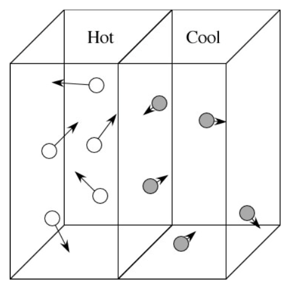

---
### Challenges/Things we learned throughout this project
1. Were able to simulate thermal equilibrium through movement of atoms in a box but unable to add colors using xyz file. Our result looked like this:
   

      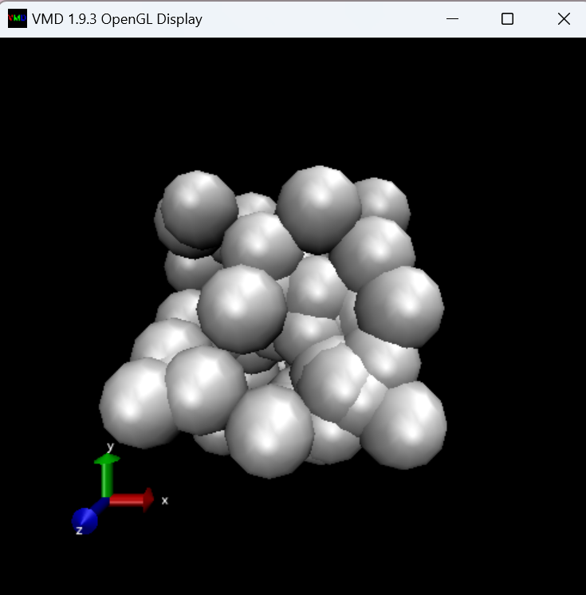
   

2. Pivoted to pmd file and figured out which coloring method to use to get colors to show up but realized kinetic energy values weren't being properly read
   

      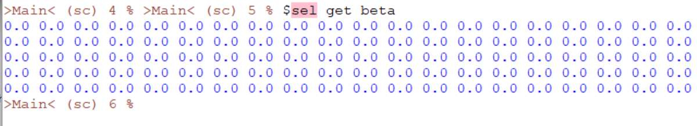
   

3. Figured out that the formatting of the pdb file wasn't aligning with our .tcl file and therefore it wasn't reading the correct values. We corrected the formatting and then it read the correct values:
   

      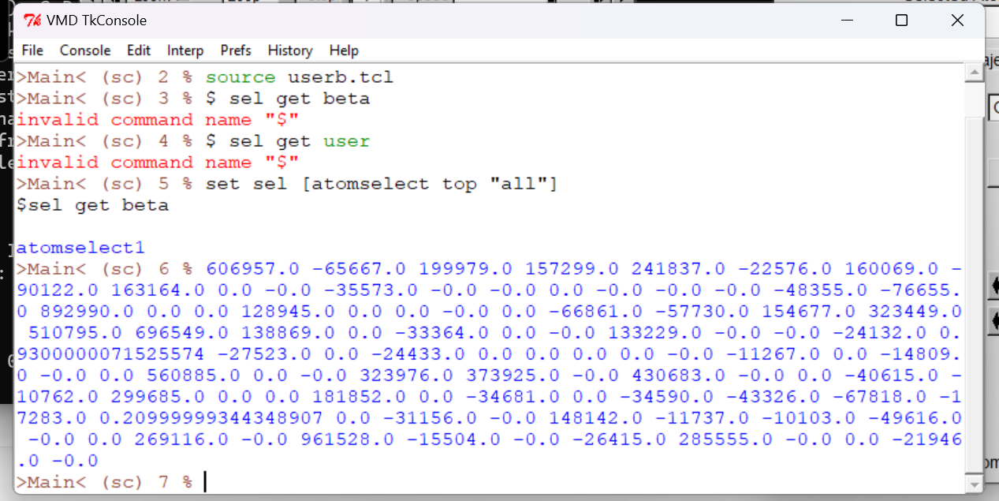
   

4. Able to fix spacing through trail and error but now we realized that our script wasn't correctly simulating the change in kinetic energy- only the change in atom position. As seen below, Atom 1's position is changing with timestep, but it's KE is not.
   

      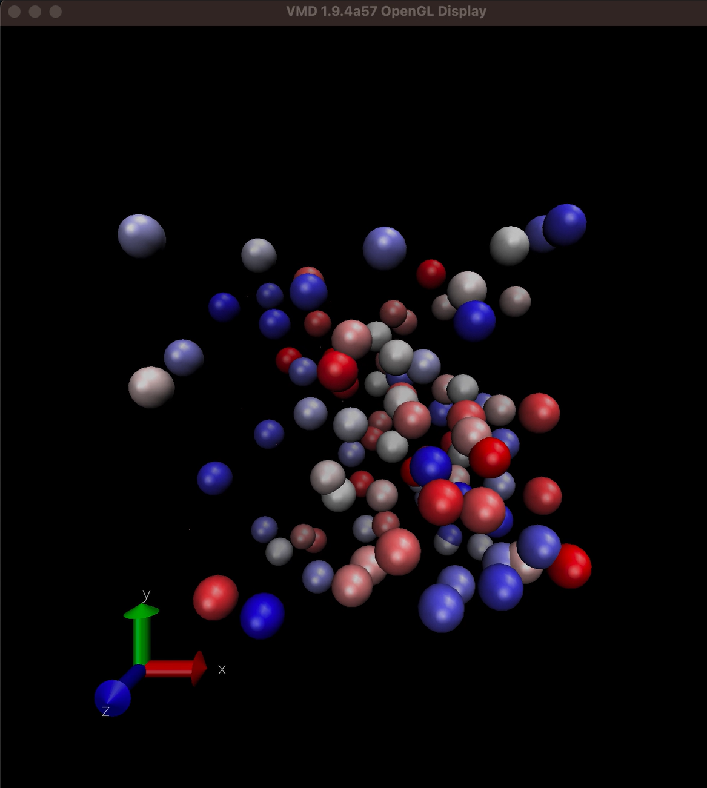
   

   
   

      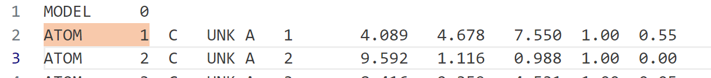
   

   
   

      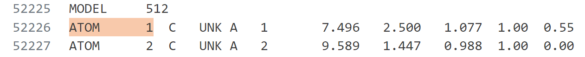
   

   
   

      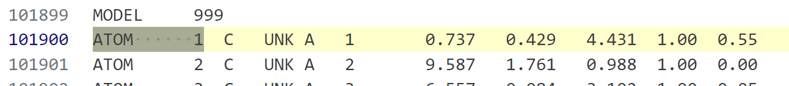
   

5. Fixed thermal_d.c to generate output.xyz where KE of atoms is changing. The colors in VMD, however, are still not changing.

   Added exchange_energy function to thermal_md:
   
   

      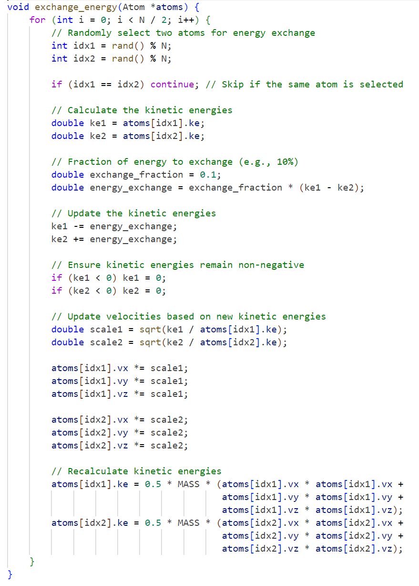
   

   
   Atom 1's KE:
   
   

      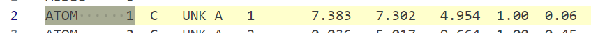
   

   
   

      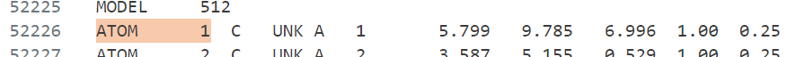
   

   
   

      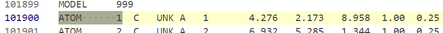
   

---
### Expected Results

The result we expect is a simulation that does this: atoms of different colors (red and blue, cold and warm) reach thermal equilibrium with time and change colors. We intuitively observe temperature changes in real-time, making the process of energy flow and distribution both accessible and engaging.
